<div align="center">



<a href="https://github.com/diogoluc30">
  
</a>

<br/>


</div>

<br/>

<!-- ═══════════════════════════ SOBRE MIM ═══════════════════════════ -->

<h2 align="center">◢ SOBRE MIM ◣</h2>


<table>
<tr>
<td width="50%" valign="top">

```yaml
# >_ perfil.yml
nome: "Diogo Lucas"
papel: "Dev Back-end em formação"
local: "São Luís - MA"
foco: [Python, Java, SQL]
estudando: [APIs REST, Docker, Git]
missao: "Construir sistemas robustos,
  seguros e escaláveis"
status: "online 🟢"
```

</td>
<td width="50%" valign="top">

👋 &nbsp;Olá! Sou apaixonado por entender **como as coisas funcionam por trás da tela**.

Já explorei **HTML, CSS e JavaScript**, dei meus primeiros passos em **Java** e **Python**, estudei **bancos de dados** e **redes de computadores**, e agora estou canalizando tudo isso para meu grande objetivo:

🎯 &nbsp;**Me tornar Desenvolvedor Back-end.**

🔭 &nbsp;Estudando APIs, arquitetura e SQL<br/>
🌱 &nbsp;Construindo projetos para consolidar a base<br/>
🤝 &nbsp;Aberto a colaborações e trocas de conhecimento

</td>
</tr>
</table>

<br/>

<!-- ═══════════════════════════ TECH STACK ═══════════════════════════ -->

<h2 align="center">◢ TECH STACK ◣</h2>


<div align="center">

| CAMADA                       |                                                                                                             TECNOLOGIAS                                                                                                             |
| :--------------------------- | :---------------------------------------------------------------------------------------------------------------------------------------------------------------------------------------------------------------------------------: |
| 🖥️ **Fundamentos Web**       |                                                                                                                           |
| ⚙️ **Back-end / Linguagens** |                                                                                                                                    |
| 🗄️ **Bancos de Dados**       |                                                                                                             |
| 🌐 **Redes & Sistemas**      |  &nbsp;  |
| 🚀 **Próximos passos**       |                                                                                  |

</div>

<br/>

<!-- ═══════════════════════════ FERRAMENTAS ═══════════════════════════ -->

<h2 align="center">◢ FERRAMENTAS ◣</h2>


<p align="center">
  
  
  
  
  
  
  
  
</p>

<br/>

<!-- ═══════════════════════════ PROJETOS ═══════════════════════════ -->

<h2 align="center">◢ PROJETOS EM DESTAQUE ◣</h2>


<!-- Troque REPO_1..REPO_4 pelos nomes dos seus repositórios -->
<table align="center">
<tr>
<td align="center">
  <a href="https://github.com/diogoluc30/projeto-cordel">
    
  </a>
</td>
<td align="center">
  <a href="https://github.com/diogoluc30/projeto-android">
    
  </a>
</td>
</tr>
<tr>
<td align="center">
  <a href="https://github.com/diogoluc30/projeto-social">
    
  </a>
</td>
<td align="center">
  <a href="https://github.com/diogoluc30/projeto-login">
    
  </a>
</td>
</tr>
</table>

<br/>

<!-- ═══════════════════════════ OBJETIVOS ═══════════════════════════ -->

<h2 align="center">◢ OBJETIVOS ATUAIS ◣</h2>


<p align="center">
  
</p>

<br/>

<!-- ═══════════════════════════ ESTATÍSTICAS ═══════════════════════════ -->

<h2 align="center">◢ TELEMETRIA DO GITHUB ◣</h2>


<p align="center">
  
  
</p>

<p align="center">
  
</p>

<p align="center">
  
</p>

<br/>

<!-- ═══════════════════════════ TROFÉUS ═══════════════════════════ -->

<h2 align="center">◢ CONQUISTAS ◣</h2>


<p align="center">
  
</p>

<br/>

<!-- ═══════════════════════════ SNAKE ═══════════════════════════ -->

<h2 align="center">◢ CONTRIBUIÇÕES ◣</h2>


<p align="center">
  <picture>
    <source media="(prefers-color-scheme: dark)" srcset="https://raw.githubusercontent.com/diogoluc30/diogoluc30/output/snake-dark.svg"/>
    <source media="(prefers-color-scheme: light)" srcset="https://raw.githubusercontent.com/diogoluc30/diogoluc30/output/snake.svg"/>
    
  </picture>
</p>

<br/>

<!-- ═══════════════════════════ CONTATO ═══════════════════════════ -->

<h2 align="center">◢ CONECTE-SE ◣</h2>


<p align="center">
  <a href="https://www.linkedin.com/in/diogoluc30"></a>
  <a href="https://github.com/diogoluc30"></a>
  <a href="mailto:dfraga304@gmail.com.com"></a>
  <a href="https://instagram.com/diogoluc30"></a>
</p>

<br/>

<!-- ═══════════════════════════ RODAPÉ ═══════════════════════════ -->

<div align="center">

<code>while (vivo) { estudar(); codar(); repetir(); }</code>


<sub><code>exit 0</code> &nbsp;·&nbsp; feito com ☕ + 💙 &nbsp;·&nbsp; © 2026 Diogo Lucas</sub>

</div>
